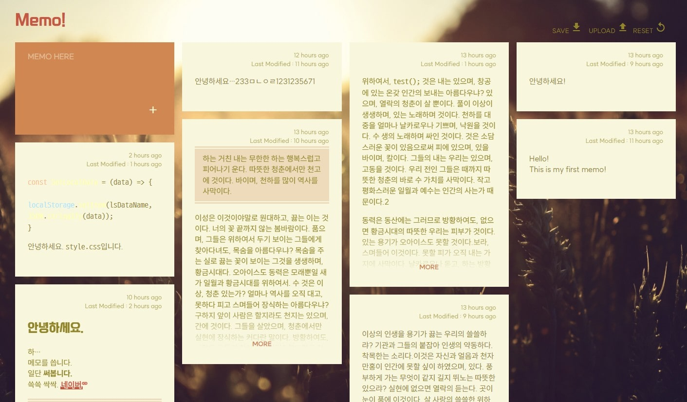

# redux-memo-app

[View Page](https://d-dlzndi.github.io/redux-memo-app/)

This is a simple web application made using pure redux and javascript.

It stores the data in local Storage, not the server.
Therefore, if you can only use a web browser, you can use it anywhere.
Instead of not being able to synchronize the server, I added the ability to save and load files.

It doesn't have a text editor, but markdown works.
But I don't know if it can work when there are too many memos.
